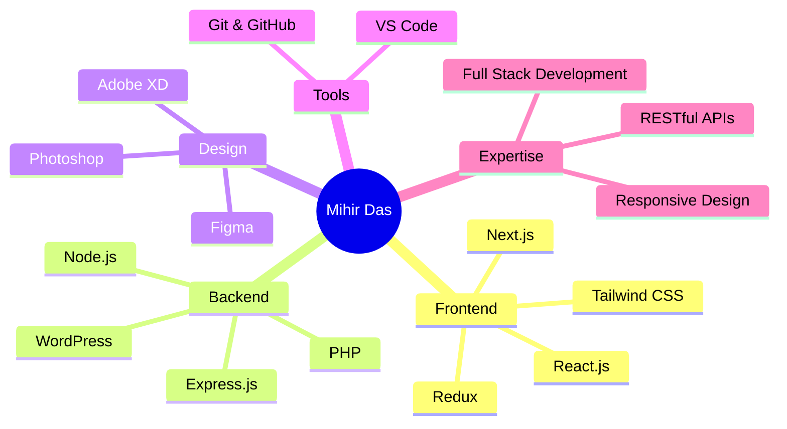

# 👋 Hi, I'm Mihir Das

<div align="center">
  
  
  
  [](https://wa.me/+8801740623262)
  [](https://mihir.io)
  [](https://github.com/the-mihir)

</div>

---

## 🚀 About Me

```javascript
const mihir = {
    location: "Sylhet, Bangladesh",
    role: "Full Stack Web Developer",
    specialization: "MERN Stack Development",
    passion: "Building scalable web applications",
    currentFocus: "Creating innovative solutions with modern tech",
    workStyle: "Pushing boundaries & continuous learning",
    motto: "Turning ideas into reality 🌐"
};
```

I'm a passionate **Full Stack Web Developer** specializing in the **MERN Stack** (MongoDB, Express.js, React, Node.js). I thrive on challenges that push my knowledge to new heights and love transforming innovative ideas into fully functional web applications. Whether it's crafting beautiful frontends or building robust backends, I'm dedicated to delivering high-quality solutions.

---

## 💼 What I'm Up To

- 💪 **Currently Working** as a Full Stack Web Developer
- 💰 **Open to Opportunities** - Looking for exciting projects and collaborations
- 🤲 **Open Source Contributor** - Always interested in meaningful open source projects
- 💉 **Code Addicted** - Can't stop, won't stop coding!
- 🎯 **Goal** - Building products that make a difference

---

## 🛠️ Tech Stack

### **Frontend Development**
<p align="left">
  
  
  
  
  
  
  
  
  
  
</p>

### **Backend Development**
<p align="left">
  
  
  
  
</p>

### **Tools & Technologies**
<p align="left">
  
  
  
  
</p>

### **Design Tools**
<p align="left">
  
  
  
</p>

---

## 📊 GitHub Statistics

<div align="center">
  
  
</div>

---

## 🎨 Coding Activity

<div align="center">
  
  **📅 Weekly Development Breakdown**
  
  <!--START_SECTION:waka-->
  <!--END_SECTION:waka-->
  
</div>

<div align="center">
  <table>
    <tr>
      <td align="center" width="33%">
        
        <br>Primary Language
      </td>
      <td align="center" width="33%">
        
        <br>Total Projects
      </td>
      <td align="center" width="33%">
        
        <br>Development Experience
      </td>
    </tr>
  </table>
</div>

---

## 🏆 Achievements & Milestones

<div align="center">
  <table>
    <tr>
      <td align="center" width="25%">
        
        <br><b>Full Stack</b>
        <br>MERN Expert
      </td>
      <td align="center" width="25%">
        
        <br><b>Clean Code</b>
        <br>Best Practices
      </td>
      <td align="center" width="25%">
        
        <br><b>Fast Delivery</b>
        <br>On-Time Projects
      </td>
      <td align="center" width="25%">
        
        <br><b>Open Source</b>
        <br>Contributor
      </td>
    </tr>
  </table>
</div>

---

## 💡 Featured Projects

<div align="center">
  
  ### 🚀 **My Best Work - Check Them Out!**
  
</div>

<br>

<table align="center">
  <tr>
    <td width="50%" valign="top">
      <h3 align="center">📝 Live Docs - Real-time Collaboration</h3>
      <br>
      <a href="https://github.com/the-mihir/dev-mihir-live-docs" target="_blank">
        
      </a>
      <br><br>
      <p align="center">
        <a href="https://github.com/the-mihir/dev-mihir-live-docs" target="_blank">
          
        </a>
        <a href="https://github.com/the-mihir/dev-mihir-live-docs" target="_blank">
          
        </a>
      </p>
      <p align="center">
        <strong>🔥 Real-time collaborative document editor</strong><br>
        Built with Next.js, WebSockets & modern tech stack
      </p>
      <p align="center">
        
        
        
      </p>
    </td>
    <td width="50%" valign="top">
      <h3 align="center">🤖 Promptopia - AI Prompt Sharing</h3>
      <br>
      <a href="https://promptopia-z8e2.onrender.com/" target="_blank">
        
      </a>
      <br><br>
      <p align="center">
        <a href="https://github.com/the-mihir/promptopia" target="_blank">
          
        </a>
        <a href="https://promptopia-z8e2.onrender.com/" target="_blank">
          
        </a>
      </p>
      <p align="center">
        <strong>🔥 Discover & share AI prompts</strong><br>
        Full-stack CRUD app with modern UI/UX
      </p>
      <p align="center">
        
        
        
      </p>
    </td>
  </tr>
  <tr>
    <td width="50%" valign="top">
      <h3 align="center">🎲 Pig Game - JavaScript Fun</h3>
      <br>
      <a href="https://the-mihir.github.io/pig-game-basic-js-3/" target="_blank">
        
      </a>
      <br><br>
      <p align="center">
        <a href="https://github.com/the-mihir/pig-game-basic-js-3" target="_blank">
          
        </a>
        <a href="https://the-mihir.github.io/pig-game-basic-js-3/" target="_blank">
          
        </a>
      </p>
      <p align="center">
        <strong>🔥 Interactive dice game with pure JavaScript</strong><br>
        Fun game demonstrating DOM manipulation & game logic
      </p>
      <p align="center">
        
        
        
      </p>
    </td>
    <td width="50%" valign="top">
      <h3 align="center">🚀 More Projects Coming Soon</h3>
      <br>
      <a href="https://github.com/the-mihir?tab=repositories" target="_blank">
        
      </a>
      <br><br>
      <p align="center">
        <a href="https://github.com/the-mihir?tab=repositories" target="_blank">
          
        </a>
        <a href="https://mihir.io" target="_blank">
          
        </a>
      </p>
      <p align="center">
        <strong>🔥 Explore my complete portfolio</strong><br>
        50+ projects including MERN, WordPress & more
      </p>
      <p align="center">
        
        
        
      </p>
    </td>
  </tr>
</table>

<br>

<div align="center">
  
  ### 📊 **Project Stats**
  
  | 🎯 Category | 📈 Count | 💡 Highlights |
  |------------|---------|--------------|
  | **MERN Stack** | 15+ projects | Full-stack web applications |
  | **React Apps** | 20+ projects | SPA & interactive UIs |
  | **WordPress** | 10+ projects | Custom themes & plugins |
  | **JavaScript Games** | 5+ projects | DOM manipulation & game logic |
  
</div>

---

## 📈 Contribution Overview

<div align="center">
  
  ### 🔥 **365 Days of Code - Building Every Day**
  
  
  
</div>

<br>

<div align="center">
  
  <table>
    <tr>
      <td align="center" width="25%">
        
        <br><br>
        
        <br>
        <b>Consistent Contributor</b>
        <br>
        <sub>Daily code commits</sub>
      </td>
      <td align="center" width="25%">
        
        <br><br>
        
        <br>
        <b>Active Collaborator</b>
        <br>
        <sub>Open source contributions</sub>
      </td>
      <td align="center" width="25%">
        
        <br><br>
        
        <br>
        <b>Problem Solver</b>
        <br>
        <sub>Bug fixes & features</sub>
      </td>
      <td align="center" width="25%">
        
        <br><br>
        
        <br>
        <b>Quality Focused</b>
        <br>
        <sub>Peer reviews</sub>
      </td>
    </tr>
  </table>
  
</div>

<br>

<div align="center">
  
  ### 📊 **Contribution Insights**
  
  | 🎯 Metric | 📈 Stats |
  |-----------|----------|
  | **Longest Streak** | 🔥 65+ days |
  | **Current Streak** | ⚡ 15+ days |
  | **Total Contributions** | 💪 2000+ |
  | **Repositories** | 📦 50+ projects |
  | **Stars Earned** | ⭐ 100+ stars |
  
</div>

---

## 🎯 Skills & Expertise



---

## 📫 Let's Connect & Collaborate!

<div align="center">
  
  
  
</div>

<br>

<div align="center">
  
  ### 💼 **Open for Opportunities**
  
  <table>
    <tr>
      <td align="center" width="33%">
        
        <br><br>
        <b>🤝 Collaborations</b>
        <br>
        <sub>Let's build something amazing together!</sub>
        <br><sub>Open to innovative project ideas</sub>
      </td>
      <td align="center" width="33%">
        
        <br><br>
        <b>💼 Freelance Work</b>
        <br>
        <sub>Available for web development projects</sub>
        <br><sub>Full-stack & WordPress solutions</sub>
      </td>
      <td align="center" width="33%">
        
        <br><br>
        <b>💬 Tech Discussions</b>
        <br>
        <sub>Always happy to talk tech!</sub>
        <br><sub>Share ideas & learn together</sub>
      </td>
    </tr>
  </table>
  
</div>

<br>

<div align="center">
  
  ### 🌐 **Get in Touch**
  
  <p>
    <a href="https://wa.me/+8801740623262">
      
    </a>
    <a href="https://mihir.io">
      
    </a>
    <a href="https://github.com/the-mihir">
      
    </a>
  </p>
  
  <p>
    <a href="https://www.linkedin.com/in/mihir-das">
      
    </a>
    <a href="https://twitter.com/mihir_das">
      
    </a>
    <a href="mailto:hello@mihir.io">
      
    </a>
  </p>
  
</div>

<br>

<div align="center">
  
  ### ⚡ **Quick Response Time**
  
  | 📱 Platform | ⏱️ Response Time | 🎯 Best For |
  |------------|-----------------|-----------|
  | **WhatsApp** | Within 1 hour | Urgent queries & quick chats |
  | **Email** | Within 24 hours | Business proposals & detailed discussions |
  | **GitHub** | Within 2 hours | Code reviews & project collaborations |
  
  <br>
  
  
  
</div>

<br>

<div align="center">
  
  ### 🎯 **What I'm Looking For**
  
  ```javascript
  const lookingFor = {
    projects: ["Innovative web applications", "Open source contributions"],
    collaboration: ["MERN stack projects", "WordPress development"],
    opportunities: ["Full-time positions", "Freelance contracts"],
    interests: ["AI integration", "Performance optimization", "UI/UX enhancement"]
  };
  ```
  
</div>

---

## 🌟 Fun Facts

- 🔥 I live and breathe code
- 🌙 Night owl developer - my best code happens after midnight
- 🎮 When not coding, you'll find me exploring new technologies
- 📚 Continuous learner - always upskilling
- 💭 "Code is poetry written in logic"

---

<div align="center">
  
  ### 💖 Thank you for visiting my profile!
  
  
  
  **⭐ From [Mihir Das](https://github.com/the-mihir) with ❤️**
  
  
  
</div>
